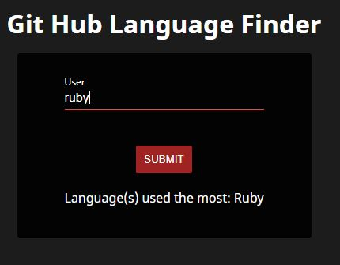

## Git Language Finder
[](https://travis-ci.com/dm-devtech/git-language-finder)
[](https://app.netlify.com/sites/git-language-finder/deploys)
- Finds the most common coding language used by a Github user
- Use the app on Heroku [Here](https://git-language-finder.herokuapp.com/)
- Use the app on Netlify [Here](https://git-language-finder.netlify.app/)

### Git Authentication
- Set up .env file with: REACT_APP_TOKEN=[YOUR API TOKEN] but replace as appropriate
- [How to set up a Git api token](https://docs.github.com/en/github/authenticating-to-github/keeping-your-account-and-data-secure/creating-a-personal-access-token)

### Running the app
- Install dependencies with 
```sh
$ yarn install
```
- To run the app 
```sh
$ yarn start
```
- On the app page enter a Github username and click submit

### Screenshots
 

### Tests
- To run tests do
```sh
$ yarn test
```

#### Code Coverage
File                 | % Stmts | % Branch | % Funcs | % Lines | Uncovered Line #s 
---------------------|---------|----------|---------|---------|-------------------
All files            |   97.01 |      100 |     100 |   96.43 |                   
 Home.js             |   97.73 |      100 |     100 |   97.37 | 59                
 getRepoData.js      |   93.33 |      100 |     100 |      90 | 15                
 retrieveUserData.js |     100 |      100 |     100 |     100 |                   

### Tech used:
- ReactJS (create-react-app)
- React testing library
