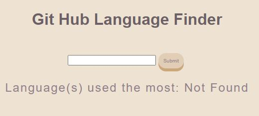

## Git Language Finder
[](https://travis-ci.com/dm-devtech/git-language-finder)


- Finds the most common coding language used by a Github user

### Git Authentication
- set up environment variable in .env file in root as follows:
REACT_APP_TOKEN='API TOKEN' but replace API TOKEN as necessary

### Running the app
- Clone the repo
- Navigate to the local repo directory
- Install dependencies with ```yarn install```
- Use ```yarn start``` to run the app
- On the app page enter a Github username and click submit

### Screenshots
 

### Tests
- To run tests do ```yarn test```

#### Code Coverage
File                 | % Stmts | % Branch | % Funcs | % Lines | Uncovered Line #s 
---------------------|---------|----------|---------|---------|-------------------
All files            |   97.01 |      100 |     100 |   96.43 |                   
 Home.js             |   97.73 |      100 |     100 |   97.37 | 59                
 getRepoData.js      |   93.33 |      100 |     100 |      90 | 15                
 retrieveUserData.js |     100 |      100 |     100 |     100 |                   

### Tech used:
- ReactJS (create-react-app)
- React testing library
